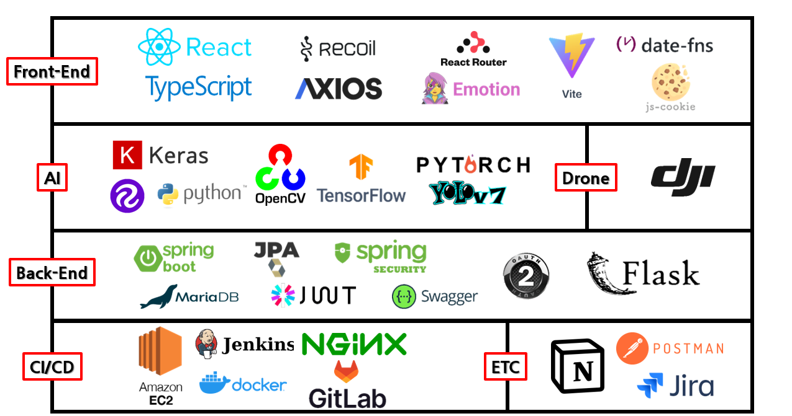
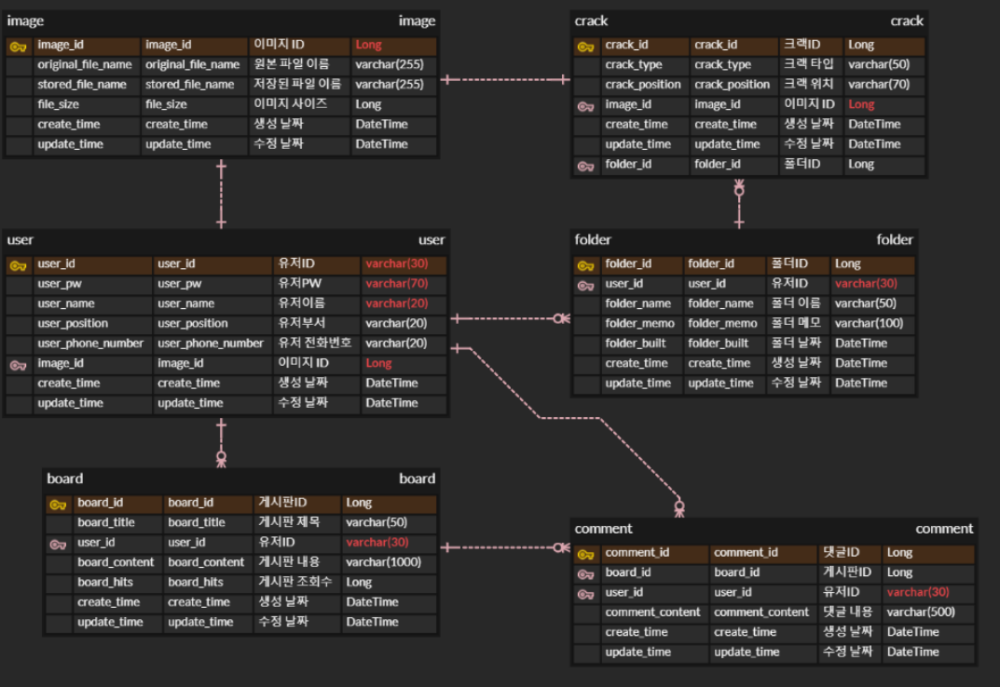

# SKYEYE
> 드론을 통한 건물 균열 파악 AI

> __D202__  
강모현, 박성환, 박재현, 양서정, 이병수, 이효진

> __개발 기간__: 2023.04.10 ~ 2023.05.26 (약 7주) 

 

## 팀원 역할
| 이름   | 역할 | 내용                         |
| ------ | ---- | ---------------------------- |
| 강모현 | AI   | AI + Flask |
| 박성환 | BE   | BE + Infra/nginx |
| 박재현 | BE   | BE + Spring Security/JWT + oauth |
| 이효진 | BE   | FE/BE + 이미지 조회 |
| 양서정 | FE   | FE + auth |
| 이병수 | FE   | FE + 이미지 업로드 |

 

### UCC ➡ [유튜브](https://www.youtube.com/watch?v=wo5gehQzfqk)
### 발표자료 ➡ [중간 발표자료](docs/발표자료/D202_중간발표.pdf) / [최종 발표자료](docs/발표자료/d202_최종발표.pdf)
### Notion ➡ [노션](https://www.notion.so/AIOT-TEAM-D202-d4febb480e784d6e83dad73a58b9c95c)

 

---

 

## 기획 배경 및 목표
### 사람이 직접 접근하기 힘든 구역의 건물 균열을 드론을 통해 탐지

### 카드를 이용한 출입 시스템의 불편함
> 카드가 없으면 출입이 불가능한 시스템 구조상 카드를 항상 소지하여야하고, 카드를 꺼내어 태깅을 해야함
또한 건물 출입 후 별도로 출근 프로세스를 진행하는 부분에 있어 불필요한 중복업무가 발생
* 이를 AI 영상분석을 통한 실시간 객체검출을 통해 출입과 동시에 출근, 퇴근시각으로 기록하여 편리한 입출입 서비스 제공

 

## 기술 스택 & 아키텍쳐

 
 

### Front-End

	
	
	
    
	
    
    
    

### Back-end

	
	
    
	
    
	
	

### AI

	
	
	
	

### TEAM Cooperation

	
	
    
	
	

 

---

 

## 서비스 소개

* AI 영상 분석을 통한 실시간 객체 검출을 통해 실시간 출퇴근 기록 서비스 제공
* SSD MobileNet를 이용하여 약 200,000번 학습된 데이터를 openCV로 IP Camera와 연동하여 학습된 모델 적용 및 객체 검출
* 인식된 Class Name으로 DB에 접근하여 출입과 동시에 DB에 출석 요청을 발송
* DB에 기록된 출결 현황 및 시간을 웹페이지에서 실시간으로 조회

 

## 시나리오

### 0. 회원가입/ 로그인 선택

#### 회원가입

	

#### 로그인 선택

	

### 1. Organization

#### 로그인

	
	

#### 회원/근무자 조회

	
	

#### 회원/근무자 등록

	
	

#### 회원/근무자 출퇴근

	

#### 군집도 확인

	

### 2. User

#### 로그인

	

#### 정보조회

	

#### 달력확인

	

### 3. Worker

#### 로그인

	

#### 정보조회

	

#### 달력확인

	

##### 상세 시연 시나리오 ➡ [노션 링크](https://www.notion.so/7c0af35d8abd45f495057c9d211105ec)

 

---

 

## DB ERD

