# SKYEYE
> 드론을 통한 건물 균열 파악 AI

> __D202__  
강모현, 박성환, 박재현, 양서정, 이병수, 이효진

> __개발 기간__: 2023.04.10 ~ 2023.05.26 (약 7주) 

 

## 팀원 역할
| 이름   | 역할 | 내용                         |
| ------ | ---- | ---------------------------- |
| 강모현 | AI   | AI + Flask |
| 박성환 | BE   | BE + Infra/nginx |
| 박재현 | BE   | BE + Spring Security/JWT + oauth |
| 이효진 | BE   | FE/BE + 이미지 조회 |
| 양서정 | FE   | FE + auth |
| 이병수 | FE   | FE + 이미지 업로드 |

 

### UCC ➡ [유튜브](https://www.youtube.com/watch?v=wo5gehQzfqk)
### 발표자료 ➡ [중간 발표자료](docs/발표자료/D202_중간발표.pdf) / [최종 발표자료](docs/발표자료/d202_최종발표.pdf)
### Notion ➡ [노션](https://www.notion.so/AIOT-TEAM-D202-d4febb480e784d6e83dad73a58b9c95c)

 

---

 

## 기획 배경 및 목표
### 사람이 직접 접근하기 힘든 구역의 건물 균열을 드론을 통해 탐지
> 고층 빌딩 혹은 교각의 경우 사람이 직접 균열을 탐지하기 힘든 부분이 존재함
* 이를 드론과 AI를 이용하여 자동으로 균열을 탐지하여 저장을 하는 서비스와 동시에 업로드 한 사진을 자동으로 분류하고 관리하는 서비스 제공

 

## 기술 스택 & 아키텍쳐

 
 

### Front-End

	
	
	
    
	
    
    
    

### Back-end

	
	
    
	
    
	
	

### AI

	
	
	
	

### TEAM Cooperation

	
	
    
	
	

 

---

 

## 서비스 소개

* 드론 원격 조종을 통하여 AI 객체 검출을 통하여 사진을 자동으로 저장
* Flask 서버에 이미지를 업로드하여 자동으로 분류 후 DB에 저장
* 웹 서버에서 분류 된 이미지를 조회 및 다운로드 진행
 

## 시나리오

### 0. 회원가입/ 로그인 선택

#### 회원가입

	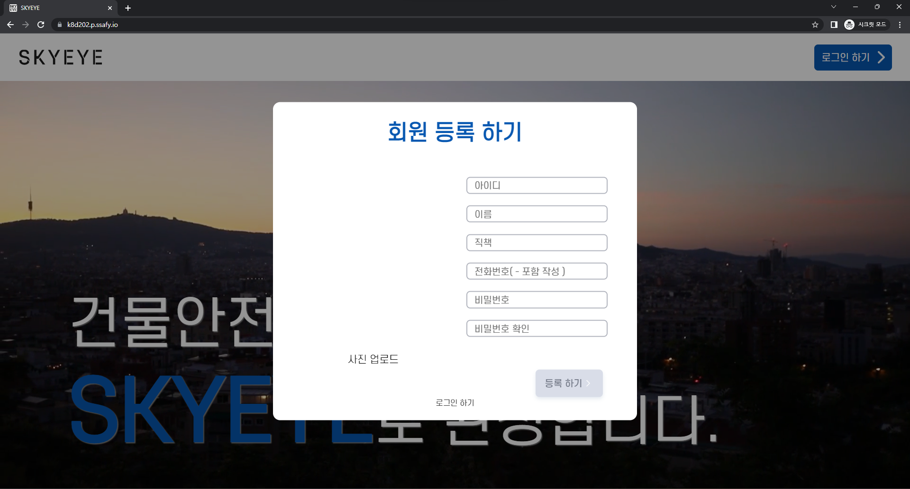

#### 로그인

	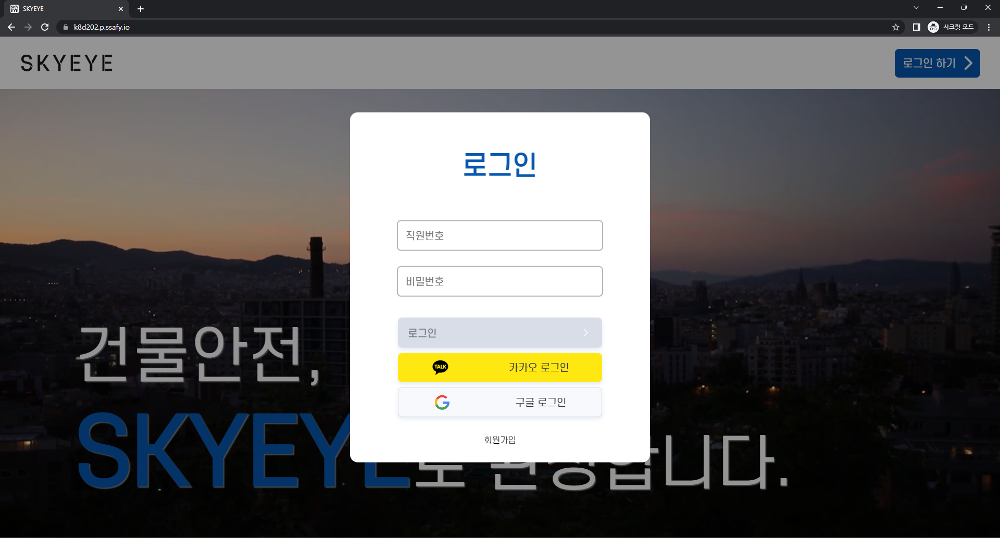

### 1. 사진 업로드

#### 로그인 후 화면

	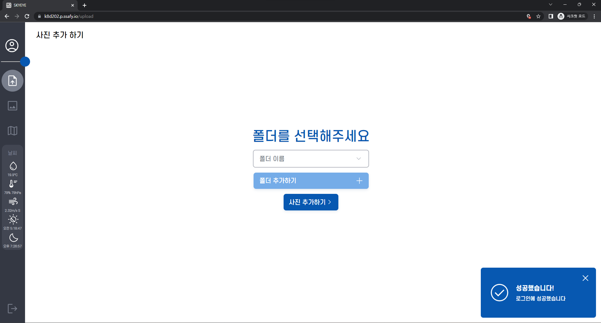

#### 폴더 

	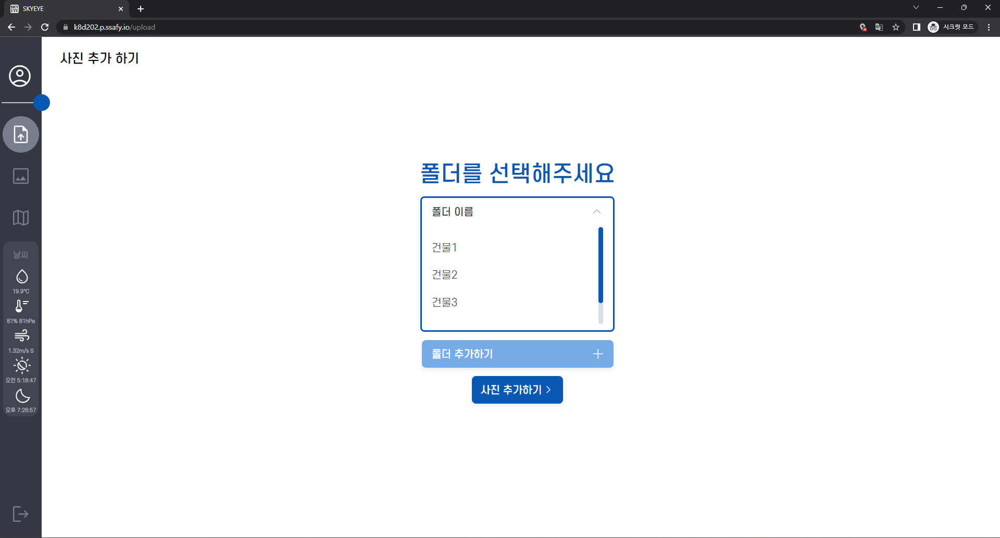
	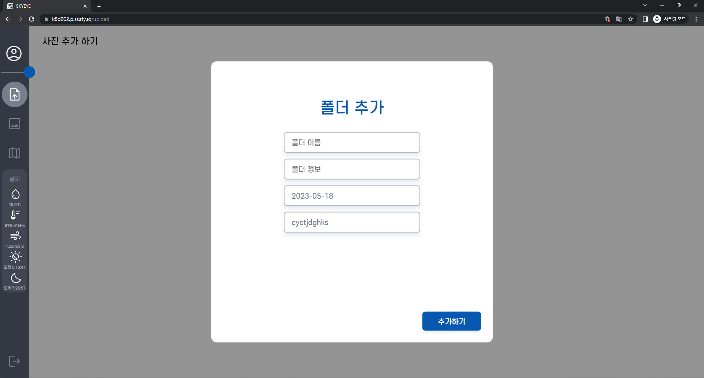
	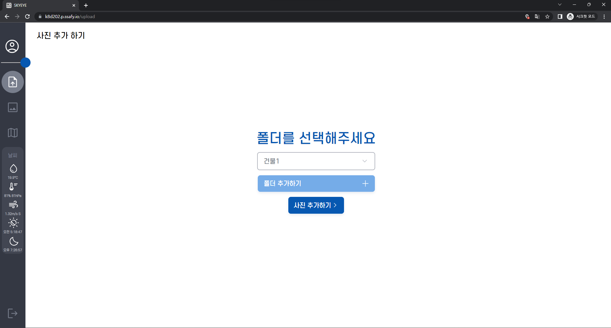
	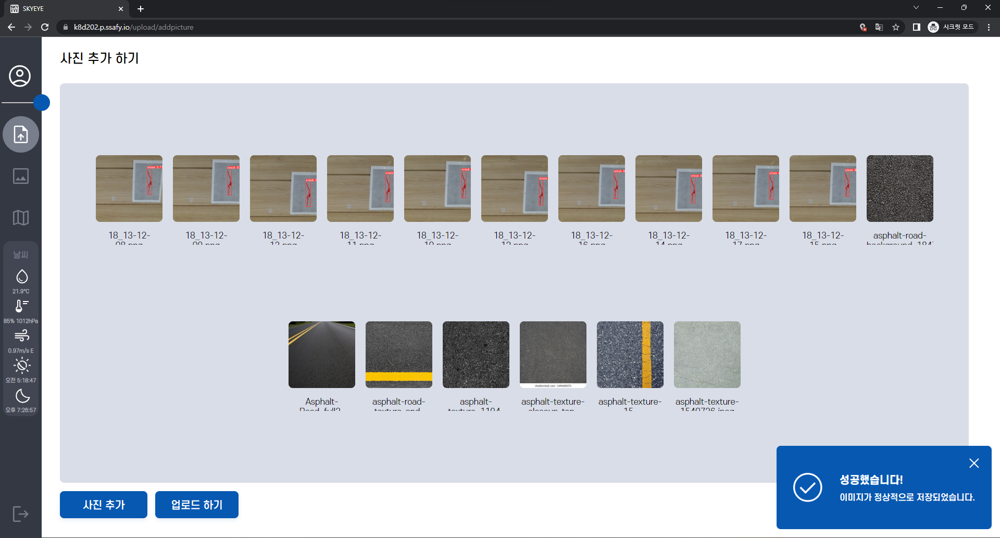

#### 비행금지구역 확인

	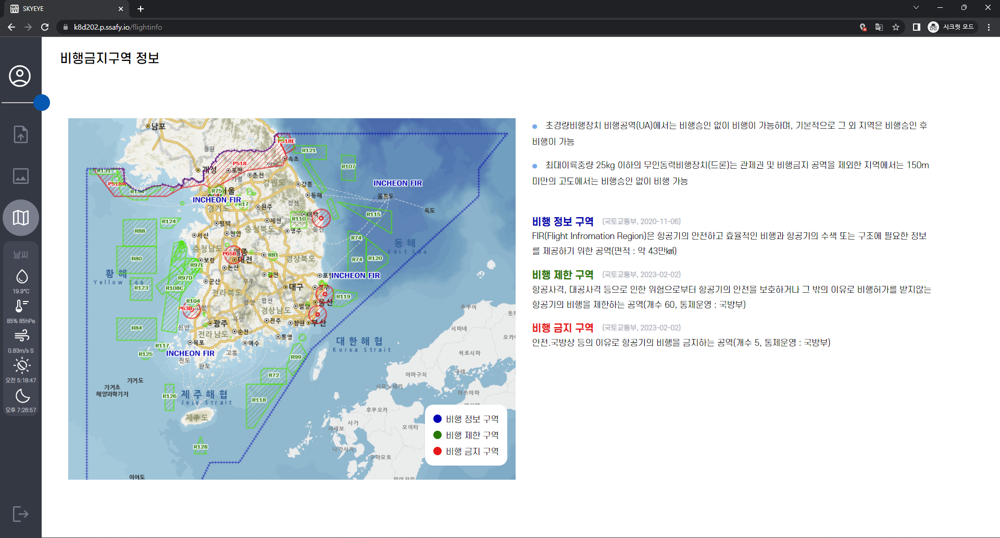

### 2. 사진 조회 / 다운로드

	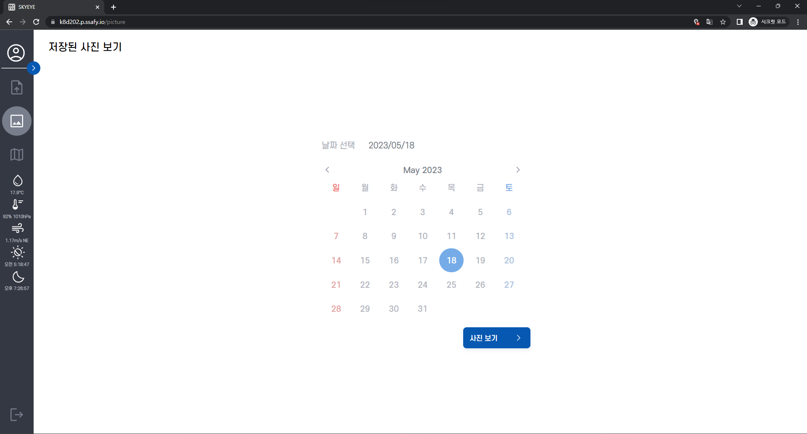
	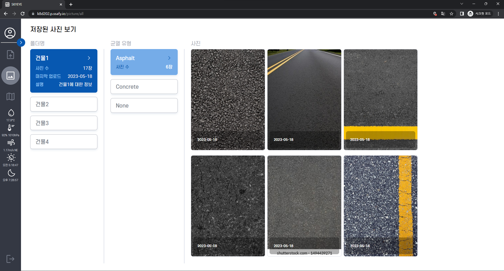
	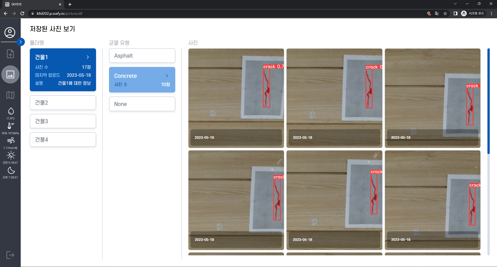
	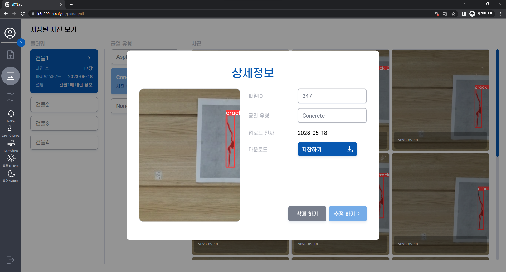

### 3. 관리자

#### 로그인

	

#### 정보조회

	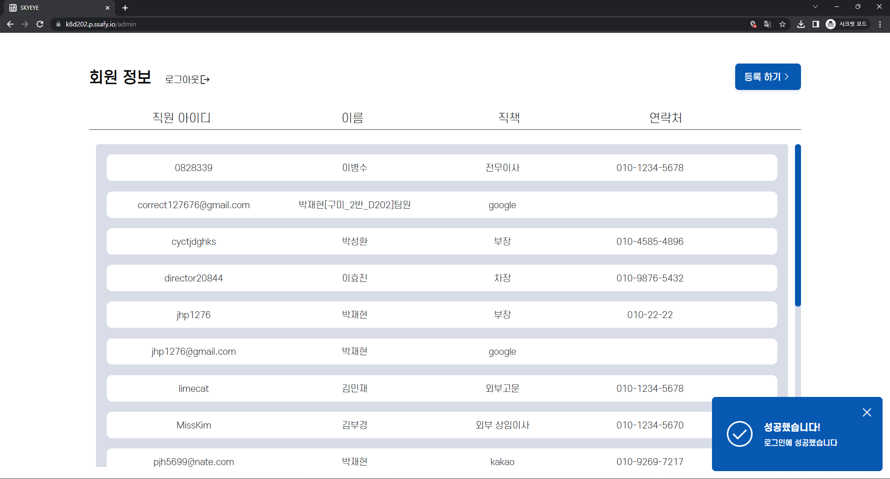

### 4. 드론 화면

#### 드론

	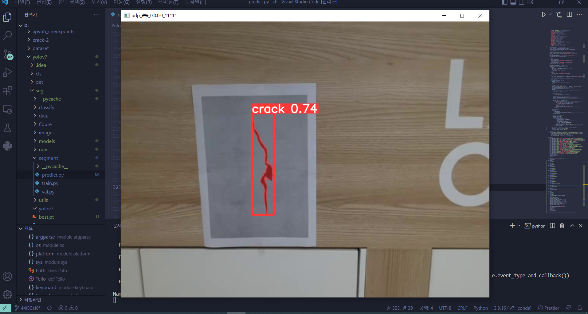
	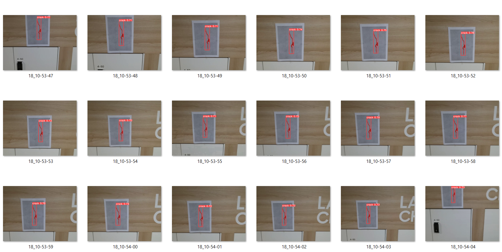

##### 상세 시연 시나리오 ➡ [노션 링크](https://www.notion.so/7c0af35d8abd45f495057c9d211105ec)

 

---

 

## DB ERD

